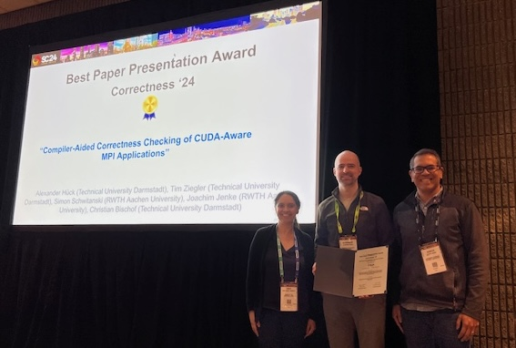

<h2>Correctness 2024: Eighth International Workshop on Software Correctness for HPC Applications</h2>

<h4> November 18, 2024 (half day, 9:00am - 12:30pm CST) </h4>

<h4> Georgia World Congress Center, Atlanta </h4>

<h4> Atlanta, Georgia, USA </h4>

<h5> Held in conjunction with SC24: <a href="https://sc24.supercomputing.org/">The International Conference for High Performance Computing, Networking, Storage and Analysis</a> </h5>

In cooperation with  

<!--

-->

----

Ensuring correctness in high-performance computing (HPC) applications is one of the fundamental challenges that the HPC community faces today. While significant advances in verification, testing, and debugging have been made to isolate software errors (or defects) in the context of non-HPC software, several factors make achieving correctness in HPC applications and systems much more challenging than in general systems software—growing heterogeneity (architectures with CPUs, GPUs, and special purpose accelerators), massive scale computations (very high degree of concurrency), use of combined parallel programing models (e.g., MPI+X), new scalable numerical algorithms (e.g., to leverage reduced precision in floating-point arithmetic), and aggressive compiler optimizations/transformations are some of the challenges that make correctness harder in HPC. The following reports lay out the key challenges and research areas of HPC correctness: (1) [DOE Report of the HPC Correctness Summit](https://www.osti.gov/biblio/1470989), (2) [DOE/NSF Workshop on Correctness in Scientific Computing](https://arxiv.org/pdf/2312.15640).

As the complexity of future architectures, algorithms, and applications in HPC increases, the ability to fully exploit exascale systems will be limited without correctness. With the continuous use of HPC software to advance scientific and technological capabilities, novel techniques and practical tools for software correctness in HPC are invaluable.

The goal of the Correctness Workshop is to bring together researchers and developers to present and discuss novel ideas to address the problem of correctness in HPC. The workshop will feature contributed papers and invited talks in this area.

----
### <a class="anchor" name="topics">Workshop Topics</a>

Topics of interest include, but are not limited to:

#### Correctness in Scientific Applications and Algorithms
* Formal methods and rigorous mathematical techniques for correctness in HPC applications
* Frameworks to address the challenges of testing complex HPC applications (e.g., multiphysics applications)
* Approaches for the specification of numerical algorithms with the goal of correctness checking
* Error identification in the design and implementation of numerical algorithms using finite-precision floating point numbers

#### Tools for Debugging, Testing, and Correctness Checking
* Program synthesis techniques for testing and debugging HPC applications
* Tools to control the effect of non-determinism when debugging and testing HPC software
* Scalable debugging solutions for large-scale HPC applications
* Scalable tools for model checking, verification, certification, or symbolic execution
* Static and dynamic analysis to test and check correctness in the entire HPC software ecosystem
* Predictive debugging and testing approaches to forecast the occurrence of errors in specific conditions
* Machine learning and anomaly detection for bug detection and localization

#### Programing Models and Runtime Systems Correctness
* Correctness in emerging HPC programing models
* Analysis of software error propagation and error handling in HPC runtime systems and libraries
* Metrics to measure the degree of correctness of HPC software
* Specifications to check the correctness of runtime systems

#### Other Areas
* Large databases of bug reports and/or reproducible test cases of HPC software
* Benchmarks to test the effectiveness of HPC correctness tools

----
### <a class="anchor" name="submissions"> Submissions and Format </a>

Authors are invited to submit manuscripts in English structured as technical or experience papers at a length of at least **6 pages** but not exceeding **8 pages** of content, including everything except references. Submissions must use the [IEEE format](https://www.ieee.org/conferences/publishing/templates.html).

<!--Submitted papers will be peer-reviewed by the Program Committee and accepted papers will be published by IEEE Xplore via TCHPC.-->
Submitted papers will be peer-reviewed by the Program Committee and accepted papers will be published by IEEE Xplore.

Submitted papers must represent original unpublished research that is not currently under review for any other venue. Papers not following these guidelines will be rejected without review. Submissions received after the due date, exceeding length limit, or not appropriately structured may also not be considered. At least one author of an accepted paper must register for and attend the workshop. Authors may contact the workshop organizers for more information. Papers should be submitted electronically at: [https://submissions.supercomputing.org/](https://submissions.supercomputing.org/). Please use the "Correctness" form (the "Correctness Short Papers" form is for HPC Bug Fest papers only).

#### SC Reproducibility Initiative

We encourage authors to submit an **optional** artifact description (AD) appendix along with their paper, describing the details of their software environments and computational experiments to the extent that an independent person could replicate their results. The AD appendix is not included in the 8-page limit of the paper and should not exceed **2 pages** of content. For more details of the **SC Reproducibility Initiative** please see: [https://sc24.supercomputing.org/program/papers/reproducibility-initiative/](https://sc24.supercomputing.org/program/papers/reproducibility-initiative/).

---

###  <a class="anchor" name="submissions"> HPC Bug Fest </a>
This year again, we have the [HPC Bug Fest](https://sites.google.com/view/hpc-bugs-fest/home), a session that will focus on correctness benchmarks. The goal is to provide a detailed snapshot of the state-of-the-art HPC verification tools by both discussing their methodologies and comparing their evaluation metrics. 

This session only accepts short papers based on four different contributions: (1) 
codes to expand existing benchmarks, (2) new metrics to evaluate verification tools, (3) new results to track tools updates, and (4) 
real world cases of error correction. An artefact description is 
mandatory to ensure reproducibility. 

More information on the website: [https://sites.google.com/view/hpc-bugs-fest/home](https://sites.google.com/view/hpc-bugs-fest/home)

HPC Bug Fest papers must be submitted electronically using the "Correctness Short Papers" form at: [https://submissions.supercomputing.org/](https://submissions.supercomputing.org/).

----

###  <a class="anchor" name="proceedings"> Proceedings </a>

The proceedings will be archived in IEEE Xplore.

---
### <a class="anchor" name="dates"> Important Dates </a>

<!--
* Paper submissions due: TBD
* Notification of acceptance: TB
* E-copyright registration completed by authors: TBD
* Camera-ready papers due: TBD
-->

* Paper submissions due: ~~July 19, 2024~~ ~~August 2, 2024~~ **Extended:** August 8, 2024
* Notification of acceptance: ~~August 23, 2024~~ September 6, 2024
* E-copyright registration completed by authors: ~~September 9, 2024~~ September 27, 2024
* Camera-ready papers due: ~~September 9, 2024~~ September 27, 2024

All time zones are AOE.

---
### <a class="anchor" name="date">Workshop Date</a>

- Half-day Workshop
- November 18, 2024, 9:00am - 12:30pm EST

---
### <a class="anchor" name="org">Organizers</a>

[Ignacio Laguna](http://lagunaresearch.org/), LLNL  
[Cindy Rubio-González](http://web.cs.ucdavis.edu/~rubio/), UC Davis

---
### <a class="anchor" name="pc">Program Committee</a>

[Alper Altuntas](https://staff.ucar.edu/users/altuntas), National Center for Atmospheric Research, USA  
[Allison H. Baker](https://staff.ucar.edu/users/abaker), National Center for Atmospheric Research, USA  
[John Baugh](https://www.ccee.ncsu.edu/people/jwb/), North Carolina State University, USA  
[Patrick Carribault](http://www.cea.fr/), CEA-DAM, France   
[Ganesh Gopalakrishnan](https://www.cs.utah.edu/~ganesh/), University of Utah, USA  
[Jan Hueckelheim](https://www.anl.gov/profile/jan-huckelheim), Argonne National Laboratory, USA  
[Michael O. Lam](https://w3.cs.jmu.edu/lam2mo/), James Madison University, USA  
[Jackson Mayo](http://www.sandia.gov/), Sandia National Laboratories, USA  
[Matthias S Mueller](https://www.i12.rwth-aachen.de/cms/lehrstuhl-fuer-hochleistungsrechnen-inf/der-lehrstuhl/team/hochleistungsrechnen/~osdf/prof-dr-rer-nat-matthias-s-mueller/?allou=1), RWTH Aachen University, Germany  
[Erdal Mutlu](https://www.pnnl.gov/people/erdal-mutlu), Pacific Northwest National Laboratory, USA  
[Pavel Panchekha](https://pavpanchekha.com/), University of Utah, USA  
[Samuel	Pollard](https://scholar.google.com/citations?user=X0zJ484AAAAJ&hl=en), Sandia National Laboratories, USA  
[Balthasar Reuter](https://www.ecmwf.int/en/about/who-we-are/staff-profiles/balthasar-reuter), uropean Centre for Medium-Range Weather Forecasts, UK  
[Emmanuelle Saillard](http://emmanuellesaillard.fr/), INRIA Bordeaux, France   
[Matt Sottile](https://scholar.google.com/citations?user=q6Z0FZMAAAAJ&hl=en), Lawrence Livermore National Laboratory, USA  
[Mohit Tekriwal](https://mohittkr.github.io/), Lawrence Livermore National Laboratory, USA  

---
### <a class="anchor" name="venue">Venue</a>

- Georgia World Congress Center, Atlanta, Georgia, USA
- Room: B315

---
### <a class="anchor" name="program">Program</a>
 

#### Workshop Introduction
<table>
<tr><td width="15">  </td> <td>9:am - 9:09am:  <b>Opening Remarks</b>, Ignacio Laguna, Cindy Rubio-González </td> </tr>
</table>

#### Numerical Correctness and Optimization (Chair: Ignacio Laguna)
<table>
<tr><td width="15">  </td> <td>9:09am - 9:26am:  Paper 1:  <b>"The Fused Multiply-Add and Global Atmospheric Models: A Distributional Investigation into a Surprising Correctness Scenario"</b>, Teo Price-Broncucia, Allison H. Baker, Michael Duda </td> </tr>

<tr><td width="15">  </td> <td>9:26am - 9:43am:  Paper 2: <b>"Toward Automated Precision Tuning of Weather and Climate Models: A Case Study"</b>, Jackson Vanover, Alper Altuntas, Cindy Rubio-González </td> </tr>

<tr><td width="15">  </td> <td>9:43am - 10am:  Paper 3: <b>"Towards Verifying Exact Conditions for Implementations of Density Functional Approximations"</b>, Sameerah Helal, Zhe Tao, Cindy Rubio-González, Francois Gygi, Aditya V. Thakur </td> </tr>
</table>

#### Break
<table>
<tr><td width="15">  </td> <td> 10am - 10:30am:  Break </td> </tr>
</table>

#### Reproducibility and Portability (Chair: Cindy Rubio-González)
<table>

<tr><td width="15">  </td> <td>10:30am - 10:47am:  Paper 4: <b>"Impacts of floating-point non-associativity on reproducibility for HPC and deep learning applications"</b>, Sanjif Shanmugavelu, Mathieu Taillefumier, Christopher Culver, Oscar Hernandez, Mark Coletti, Ada Sedova </td> </tr>

<tr><td width="15">  </td> <td>10:47am - 11:04am:  Paper 5: <b>"Toward Automated Detection of Portability Bugs in Kokkos Parallel Programs"</b>, Vivek KaleHanru Yan, Shyamali Mukherjee, Jackson Mayo, Keita Teranishi, Richard Rutledge, Alessandro Orso </td> </tr>
</table>

#### OpenMP Correctness (Chair: Ignacio Laguna)
<table>
<tr><td width="15">  </td> <td>11:04am - 11:21am:  Paper 6: <b>"Facilitating Bug Detection for OpenMP Offloading Applications"</b>, Lechen Yu, Feiyang Jin, Joachim Jenke, Vivek Sarkar</td> </tr>

<tr><td width="15">  </td> <td>11:21am - 11:38am:  Paper 7: <b>"ompTest – Unit Testing with OMPT"</b>, Jan-Patrick Lehr, Michael Halkenhäuser, Dhruva Chakrabarti, Saiyedul Islam, Dan Palermo, Ron Lieberman </td> </tr>
</table>

#### Data Races (Chair: Cindy Rubio-González)
<table>
<tr><td width="15">  </td> <td>11:38am - 11:55am:  Paper 8: <b>"Compiler-Aided Correctness Checking of CUDA-Aware MPI Applications"</b>, Alexander Hück, Tim Ziegler, Simon Schwitanski, Joachim Jenke, Christian Bischof</td> </tr>

<tr><td width="15">  </td> <td>11:55am - 12:12pm:  Paper 9: <b>"Taskgrind: Heavyweight Dynamic Binary Instrumentation for Parallel Programs Analysis"</b>, Romain Pereira, George Stelle, Patrick Carribault</td> </tr>
</table>

#### HPC Bugs Fest - Short Papers (Chair: Mihail Popov)
<table>
<tr><td width="15">  </td> <td>12:12pm - 12:18pm:  Paper 1: <b>"Designing Quality MPI Correctness Benchmarks: Insights and Metrics"</b>,
       Tim Jammer, Simon Schwitanski, Emmanuelle Saillard, Alexander Hück, Joachim Jenke, Radjasouria Vinayagame, Christian Bischof</td> </tr>

<tr><td width="15">  </td> <td>12:18pm - 12:24pm:  Paper 2: <b>"Correctness Checking of MPI+OpenMP Applications Using Vector Clocks in MUST"</b>,
      Cornelius Pätzold, Simon Schwitanski, Joachim Jenke, Felix Tomski, Matthias S. Müller</td> </tr>

<tr><td width="15">  </td> <td>12:24pm - 12:30pm:  Paper 3: <b>"OMPTBench – OpenMP Tool Interface Conformance Testing"</b>,
      Jan-Patrick Lehr, Michael Halkenhäuser, Dhruva Chakrabarti, Saiyedul Islam, Dan Palermo, Ron Lieberman</td> </tr>
</table>

---
###  <a class="anchor" name="award">Best Paper Presentation Award</a>

We are introducing this year the **Best Paper Presentation Award**. The goal is to reward high-quality presentations, motivating speakers at the workshop to deliver their best work. We believe that advancing the field of Correctness in HPC requires more engagement and collaboration between the research, development, and applications communities, and better presentations will lead to more engaging and informative sessions. Higher quality presentations will also help us to present the benefits of Correctness methods to our sponsors. 

A high-quality presentation should present clearly the correctness problem being addressed and its impact to scientific / HPC applications, and it should be easy to follow even for attendees that are not familiar with traditional correctness methods (formal methods, verification, testing, debugging, among others). Overall the presentation should make such methods and results more accessible to the general audience of the workshop and the SC community.

Only regular papers are eligible for the Best Paper Presentation Award (short papers are not eligible).

#### Winner
The winner of the **Best Paper Presentation Award** is the paper "Compiler-Aided Correctness Checking of CUDA-Aware MPI Applications", co-authored by Alexander Hück, Tim Ziegler, Simon Schwitanski, Joachim Jenke, Christian Bischof. Congratulations!

---
###  <a class="anchor" name="contact">Contact Information</a>
Please address workshop questions to [Ignacio Laguna](https://lagunaresearch.org/) (ilaguna@llnl.gov) and/or [Cindy Rubio-González](https://web.cs.ucdavis.edu/~rubio/) (crubio@ucdavis.edu).

---
### <a class="anchor" name="previous">Previous Workshops</a>
- [Correctness 2023](https://correctness-workshop.github.io/2023/)
- [Correctness 2022](https://correctness-workshop.github.io/2022/)
- [Correctness 2021](https://correctness-workshop.github.io/2021/)
- [Correctness 2020](https://correctness-workshop.github.io/2020/)
- [Correctness 2019](https://correctness-workshop.github.io/2019/)
- [Correctness 2018](https://correctness-workshop.github.io/2018/)
- [Correctness 2017](https://correctness-workshop.github.io/2017/)

